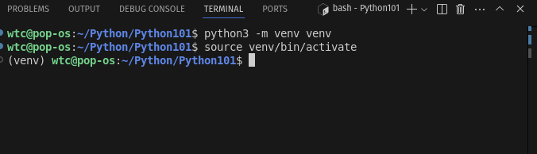
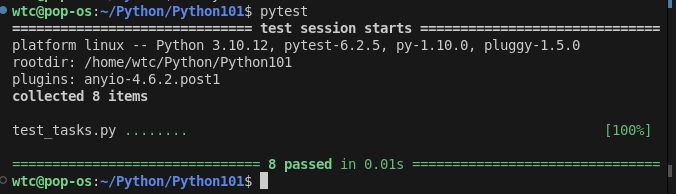

# Python Basics Project

Welcome to the Python Basics Project! In this project, you will practice working with **user inputs, variables, data types, data structures, if/else statements, and for/while loops**.


## Instructions

### Step 1: Set Up Your Environment

1. **Navigate to the Project Directory**:  
   - Move into the project folder:  
     ```bash
     cd Python101
     ```

2. **Set Up a Virtual Environment**:  
   - Create a virtual environment:  
     ```bash
     python -m venv venv
     ```
   - Activate the virtual environment:  
     - On Windows:  
       ```bash
       venv\Scripts\activate
       ```
     - On macOS/Linux:  
       ```bash
       source venv/bin/activate
       ```
   - Your terminal should now show the virtual environment name (e.g., `(venv)`) like this:
   

3. **Install Dependencies**:  
   - Install the required packages:  
     ```bash
     pip install -r requirements.txt
     ```

---

### Step 2: Complete the Tasks

1. **Complete the Tasks**:  
   - Open `tasks.py` and implement the functions as described in the docstrings.  
   - Test your implementation using the provided unit tests.

2. **Run the Tests**:  
   - Run the tests and make sure they all pass:  
     ```bash
     pytest test_tasks.py
     ```
   - Passing test cases will appear like this:
     

3. **Deactivate the Virtual Environment**:  
   - When you're done working, you can deactivate the virtual environment:  
     ```bash
     deactivate
     ```

4. **Commit and Push Your Changes**:  
   - Add your changes:  
     ```bash
     git add tasks.py
     ```
   - Commit your changes:  
     ```bash
     git commit -m "Completed tasks"
     ```
   - Push your changes to your branch:  
     ```bash
     git push origin main
     ```

5. **Submit a Pull Request**:  
   - Go to your forked repository on GitHub and click "New Pull Request".  
   - Select your branch (`YOUR_NAME`)from https://github.com/WTC-Hive/Python and submit the pull request to the main repository.
   
---

## Tasks Overview

### Task 1: User Input and Variables
- Ask the user for their name, age, and favorite color.  
- Return a dictionary with the collected information.

### Task 2: Data Types and Variables
- Calculate the Body Mass Index (BMI) using weight and height.  
- Return the BMI rounded to 2 decimal places.

### Task 3: Data Structures (Lists)
- Create a shopping list from a list of items.  
- Return a dictionary with items as keys and quantities as values.

### Task 4: Data Structures (Dictionaries)
- Count the frequency of each word in a string.  
- Return a dictionary with words as keys and frequencies as values.

### Task 5: If/Else Statements
- Check if a number is positive, negative, or zero.  
- Return the appropriate string.

### Task 6: For Loops
- Sum all even numbers in a list.  
- Return the sum.

### Task 7: While Loops
- Find the first negative number in a list.  
- Return the first negative number or `None` if there are no negative numbers.

### Task 8: Combined Concepts
- Analyze a string to count the number of words and vowels.  
- Return a dictionary with the results.
