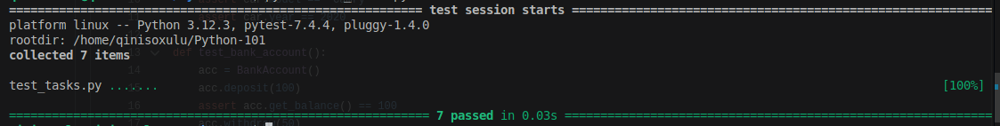

# Python Classes Project

Welcome to the Python Classes Project! This project focuses on **object-oriented programming (OOP)** concepts in Python, including classes, inheritance, methods, and more.

## Instructions

### Step 1: Set Up Your Environment

1. **Navigate to the Project Directory**:  
   - Move into the project folder:  
     ```bash
     cd Python103
     ```

2. **Set Up a Virtual Environment**:  
   - Create a virtual environment:  
     ```bash
     python -m venv venv
     ```
   - Activate the virtual environment:  
     - On Windows:  
       ```bash
       venv\Scripts\activate
       ```
     - On macOS/Linux:  
       ```bash
       source venv/bin/activate
       ```
   - Your terminal should now show the virtual environment name (e.g., `(venv)`) like this:
   

3. **Install Dependencies**:  
   - Install the required packages:  
     ```bash
     pip install -r requirements.txt
     ```

---

### Step 2: Complete the Tasks

1. **Complete the Tasks**:  
   - Open `tasks.py` and implement the functions as described in the docstrings.  
   - Test your implementation using the provided unit tests.

2. **Run the Tests**:  
   - Run the tests and make sure they all pass:  
     ```bash
     pytest test_tasks.py
     ```
   - Passing test cases will appear like this:
     

3. **Deactivate the Virtual Environment**:  
   - When you're done working, you can deactivate the virtual environment:  
     ```bash
     deactivate
     ```

4. **Commit and Push Your Changes**:  
   - Add your changes:  
     ```bash
     git add tasks.py
     ```
   - Commit your changes:  
     ```bash
     git commit -m "Completed tasks"
     ```
   - Push your changes to your branch:  
     ```bash
     git push origin main
     ```

5. **Submit a Pull Request**:  
   - Go to your forked repository on GitHub and click "New Pull Request".  
   - Select your branch (`YOUR_NAME`)from https://github.com/WTC-Hive/Python and submit the pull request to the main repository.
   
---

## Tasks Overview

1. **Vehicle Class**: Basic class with attributes.
2. **BankAccount Class**: Methods for deposits, withdrawals, and balance checks.
3. **Inheritance**: Override a method in a subclass.
4. **Class Methods**: Create a student from a string.
5. **Static Methods**: Implement math operations.
6. **Properties**: Temperature conversion between Celsius and Fahrenheit.
7. **Operator Overloading**: Add two vectors.
8. **Exception Handling**: Validate book title/author.
9. **Mixin Class**: JSON serialization.
10. **Abstract Class**: Implement shape methods.

## Need Help?

If you encounter issues, feel free to ask for assistance. Happy coding! 🚀
